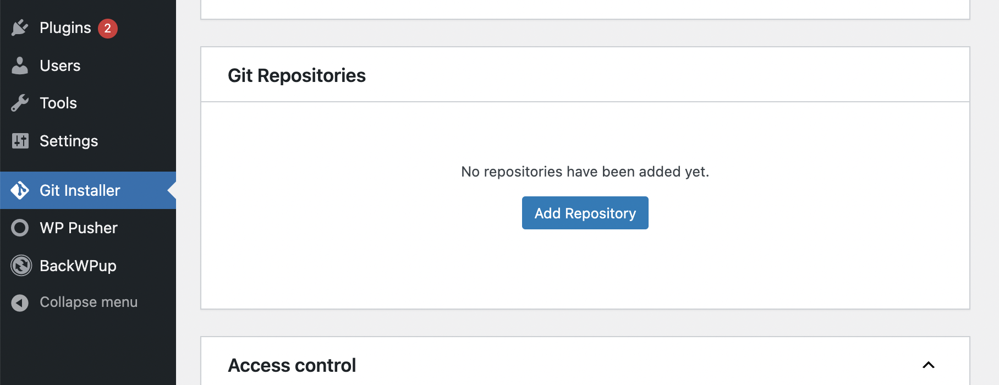
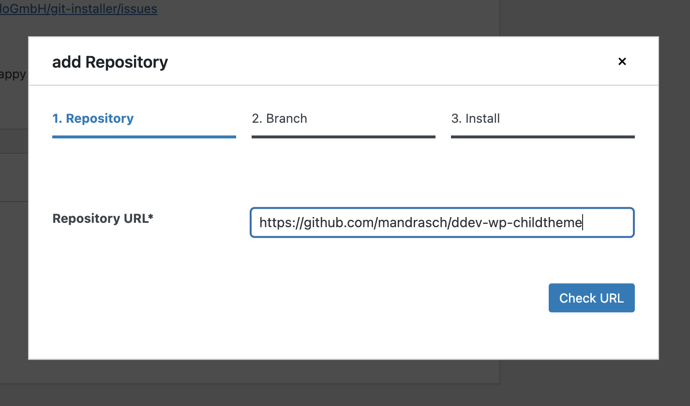
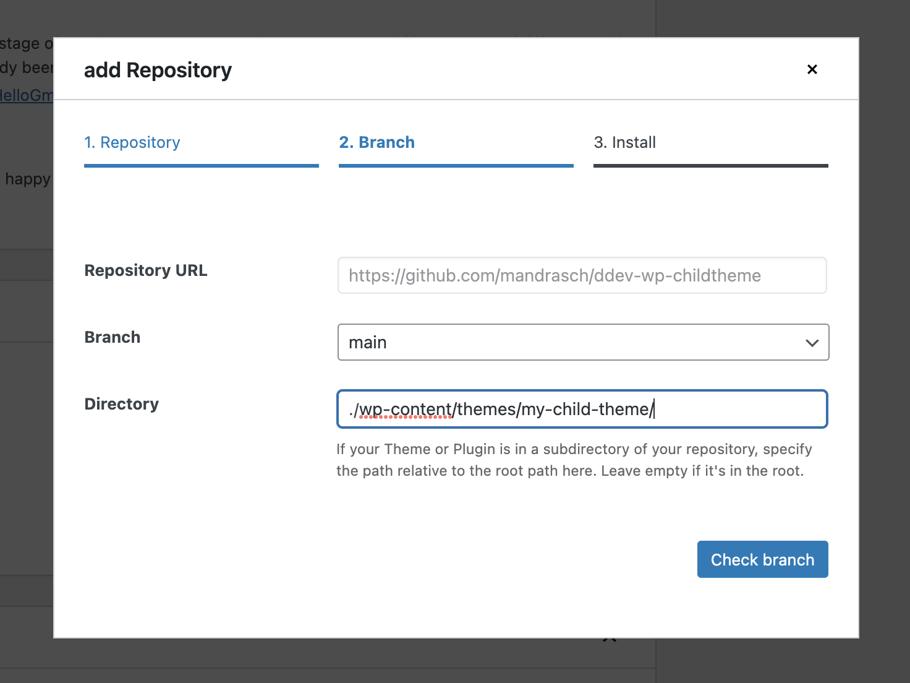
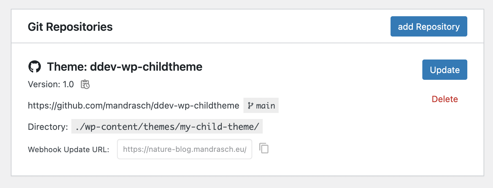

# ddev-wp-childtheme

Repository for really simple and minimalistic child theme development.

## Develop locally

1. Install [DDEV](https://ddev.readthedocs.io/en/latest/users/install/ddev-installation/) on your computer
1. Click "Use this template"
1. Clone the repository to your local harddrive
1. Run `ddev start` inside the cloned folder
1. Run `ddev wp core download`
1. Run `ddev launch` and finish installation
1. Activate the child theme (`ddev wp theme activate my-child-theme`)

Have fun developing!

## Deploy it

1. Install a WordPress live site
1. Install plugin [SayHelloGmbH/git-installer](https://github.com/SayHelloGmbH/git-installer)
1. Use the following configuration with your values:

Please consider sponsoring the development of git installer: https://github.com/sponsors/SayHelloGmbH

## Advanced usage: Pull live site data

If you want to develop with live data, see: https://my-ddev-lab.mandrasch.eu/tutorials/cms-and-frameworks/wordpress.html#pulling-wordpress
